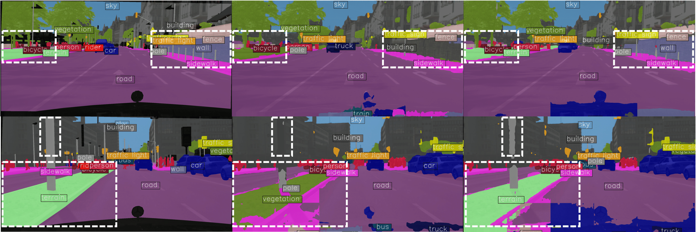

<h1 align="center">
  VocAlign<br>
  <sub>Source-free Adaptation for Open-vocabulary Semantic Segmentation</sub><br>
</h1>

<p align="center" style="margin-top: -10px; font-size: 0.85em;">
  BMVC 2025
</p>

<br>

<p align="center">
  <strong>
    Silvio Mazzucco<sup>1,2 *</sup> &nbsp;&nbsp; 
    Carl Persson<sup>1,3 *</sup> &nbsp;&nbsp; 
    Mattia Segu<sup>1,2,4</sup><br> 
    Pier Luigi Dovesi<sup>1,3</sup> &nbsp;&nbsp; 
    Federico Tombari<sup>4,5</sup> &nbsp;&nbsp;
    Luc Van Gool<sup>6</sup> &nbsp;&nbsp;  
    Matteo Poggi<sup>1,7</sup>
  </strong>
</p>

<p align="center">
  <sup>1</sup>The Good AI Lab &nbsp;&nbsp;
  <sup>2</sup>ETH Zurich &nbsp;&nbsp;
  <sup>3</sup>AMD Silo AI &nbsp;&nbsp;
  <sup>4</sup>Google<br>
  <sup>5</sup>Technical University of Munich &nbsp;&nbsp;
  <sup>6</sup>INSAIT, Sofia University, St. Kliment Ohridski &nbsp;&nbsp;
  <sup>7</sup>University of Bologna
</p>

<p align="center">
  <sub>
    <sup>*</sup>Joint first authorship
  </sub>
</p>

<p align="center">
  <a href="https://arxiv.org/abs/2509.15225">
    
  </a>
  &nbsp;&nbsp;
  <a href="https://thegoodailab.org/blog/vocalign">
    
  </a>
</p>


This is the official implementation of VocAlign, a method to perform source-free domain adaptation on CAT-Seg. 
VocAlign is presented in **"Lost in Translation? Vocabulary Alignment for Source-Free Adaptation in Open-Vocabulary Semantic Segmentation"**, [BMVC 2025](https://bmvc2025.bmva.org/).


<p align="center">
  
</p>

## Installation

**Step 1.** Clone the repository with recursive option for the submodule:

```shell
git clone --recursive https://github.com/Sisso16/VocAlign
```

If you already cloned without `--recursive`, initialize the submodule:

```shell
git submodule update --init --recursive
```

**Step 2.** Create a conda environment and install packages (this might take a while):

```shell
conda env create -f environment.yml
conda run -n vocalign mim install "mmcv==2.1.0"
conda activate vocalign
```

## Dataset

```none
VocAlign
├── mmseg
├── tools
├── configs
├── data
│   ├── cityscapes
│   │   ├── cityscapes.json
│   │   ├── cityscapes_guidance.json
│   │   ├── leftImg8bit
│   │   │   ├── train
│   │   │   ├── val
│   │   ├── gtFine
│   │   │   ├── train
│   │   │   ├── val
```
First download cityscapes dataset (leftImg8bit) and ground truth (gtFine) from their [website](https://www.cityscapes-dataset.com/). 
Then in the `data/cityscapes` directory add the `cityscapes.json` and `cityscapes_guidance.json` files.

cityscapes.json is the following:

```none
["road", "sidewalk", "building", "wall", "fence", "pole", "traffic light", "traffic sign", "vegetation", "terrain", "sky", "person", "rider", "car", "truck", "bus", "train", "motorcycle", "bicycle"]
```

cityscapes_guidance.json used in our experiments to achieve the best result was:

```none
["road", "sidewalk", "building", "house", "individual standing wall which is not part of a building", "fence", "hole in fence", "pole", "metal", "railing", "sign pole", "traffic light", "light", "traffic sign", "street sign", "parking sign", "direction sign", "vegetation", "tree", "terrain", "grass", "soil", "sand", "sky", "person", "pedestrian", "rider", "driver", "passenger", "car", "van", "truck", "truck trailer", "bus", "train", "tram", "motorcycle", "scooter", "bicycle"]
```

If you modify the concepts in `cityscapes_guidance` make sure you also modify the `classes_to_concepts` dict(list) assignments in the correspondent config file.

## Run experiments
To resume from pre-trained CAT-Seg, create a folder `work_dirs/cityscapes/`, in this folder create a file `last_checkpoint` and copy paste the path to the checkpoint. The link to download the checkpoint can be found in CAT-Seg [README](CAT-Seg/README.md#ade20k-150-zeroshot).


### Train VocAlign
```shell
vocalign-train configs/vocalign/cityscapes.py --resume
```

### Evaluate VocAlign
In the config file set [lora_eval](configs/vocalign/cityscapes.py#L87) to True. In `last_checkpoint` the path automatically updates at the end of VocAlign training. If you just want to perform inference without previously having conducted the training yourself, just copy paste manually the path to the desired VocAlign checkpoint.

```shell
vocalign-test configs/vocalign/cityscapes.py work_dirs/cityscapes/best_cityscapes.pth
```

If you want to visualize results generated during evaluation, specify the `--work_dir` and change the [interval](configs/vocalign/cityscapes.py#L144) to the desired one.

## License
 See [LICENSE](LICENSE) for details about the license terms for this repository.

## Acknowledgements
We based our code on the [mmsegmentation](https://github.com/open-mmlab/mmsegmentation) codebase.

## Citation
If you find this code useful, please cite our work:

```
@inproceedings{Mazzucco2025lost,
  title        = {Lost in Translation? Vocabulary Alignment for Source-Free Adaptation in Open-Vocabulary Semantic Segmentation},
  author       = {Mazzucco, Silvio and Persson, Carl and Segu, Mattia and Dovesi, Pier Luigi and Tombari, Federico and Van Gool, Luc and Poggi, Matteo},
  booktitle    = {British Machine Vision Conference},
  note         = {BMVC},
  year         = {2025}
}
```
